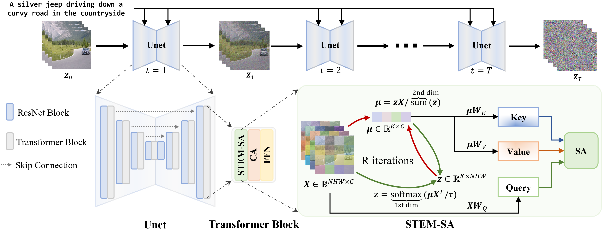

# A Video is Worth 256 Bases: Spatial-Temporal Expectation-Maximization Inversion for Zero-Shot Video Editing, CVPR 2024

[Maomao Li](https://scholar.google.com/citations?user=ym_t6QYAAAAJ&hl=en&oi=ao), 
[Yu Li](https://yu-li.github.io/), 
[Tianyu Yang](https://tianyu-yang.com), 
[Yunfei Liu](https://scholar.google.com/citations?user=B1Z1vTMAAAAJ&hl=zh-CN), 
Dongxu Yue, 
[Zhihui Lin](https://scholar.google.com.hk/citations?hl=zh-CN&user=t4et8FEAAAAJ), 
[Dong Xu](https://scholar.google.com/citations?user=7Hdu5k4AAAAJ&hl=en&oi=ao)


<a href='https://arxiv.org/abs/2310.15081'></a> 
<a href='https://stem-inv.github.io/page/'></a>
[](https://github.com/STEM-Inv/stem-inv)


## 🦴 Abstract
<b>TL; DR:</b> STEM inversion is a efficient video inversion method for text-guided video editing.

<details><summary>Click for the full abstract</summary>

> We present a video inversion approach for zero-shot video editing, which aims to model the input video with low-rank representation during the inversion process. The existing video editing methods usually apply the typical 2D DDIM inversion or naive spatial-temporal DDIM inversion before editing, which leverages time-varying representation for each frame to derive noisy latent. Unlike most existing approaches, we propose a Spatial-Temporal Expectation-Maximization (STEM) inversion, which formulates the dense video feature under an expectation-maximization manner and iteratively estimates a more compact basis set to represent the whole video. Each frame applies the fixed and global representation for inversion, which is more friendly for temporal consistency during reconstruction and editing. Extensive qualitative and quantitative experiments demonstrate that our STEM inversion can achieve consistent improvement on two state-of-the-art video editing methods.
</details>

## 🚀 Method Overview
<div align="center">
    
</div>

The illustration of the proposed STEM inversion method. We estimate a more compact representation (bases $\mathbf{\mu}$) for the input video via the EM algorithm. The ST-E step and ST-M step are executed alternately for R times until convergence. The Self-attention (SA) in our STEM inversion are denoted as STEM-SA, where the $\rm{Key}$ and $\rm{Value}$ embeddings are  derived by projections of the converged $\mathbf{\mu}$.

## 📋 Changelog

- **2023.12.11** Paper is released! 
- **2024.05.01** The code based on TokenFlow editing is released!

## 🏗️ Todo

- [x] Release the STEM inversion code
- [ ] Release the code based on FateZero editing


## ▶️ Quick Start for TokenFlow video editing using STEM inversion
### Environment
Prepare the Conda environment using the following commands:
```bash
git clone https://github.com/STEM-Inv/stem-inv
cd stem-inv
cd TokenFlow-Edit
conda create -n stem-tf python=3.9
conda activate stem-tf
pip install -r requirements.txt
```


### Video Editing
We provide demo source videos in the ```data``` folder. 
The corresponding config for STEM Inversion and Editing is in the ```configs``` folder. 
Below are the instructions for performing video editing on the provided source videos. 
You can run the following command to perform inversion and editing process at once:
```bash
bash run_editing.sh
```
The inversion results are saved in ```Stem_Inv_Latents/base_256_iter_5```, and the editing results are saved in ```STEM_TF_results```.


If you are only interested the reconstruction results of STEM inversion, please run:
```bash
bash run_inversion.sh
```

Note that our default setting is to use 256 bases to represent the whole input video, where 5 iterations are applied for EM algorithm convergence. You can also consider other configurations by modifying the values of “num_bases” and "n_iters" in line 88 of tokenflow_utils.py.


## 📎 Citation 

```
@article{li2023video,
  title={A Video is Worth 256 Bases: Spatial-Temporal Expectation-Maximization Inversion for Zero-Shot Video Editing},
  author={Li, Maomao and Li, Yu and Yang, Tianyu and Liu, Yunfei and Yue, Dongxu and Lin, Zhihui and Xu, Dong},
  journal={arXiv preprint arXiv:2312.05856},
  year={2023}
}
``` 


## 📣 Disclaimer

This is official code of STEM Inversion.
All the copyrights of the demo images and audio are from community users. 
Feel free to contact us if you would like remove them.


## 💞 Acknowledgements
The code is built upon the below repositories, we thank all the contributors for open-sourcing.
* [TokenFlow](https://github.com/omerbt/TokenFlow)


